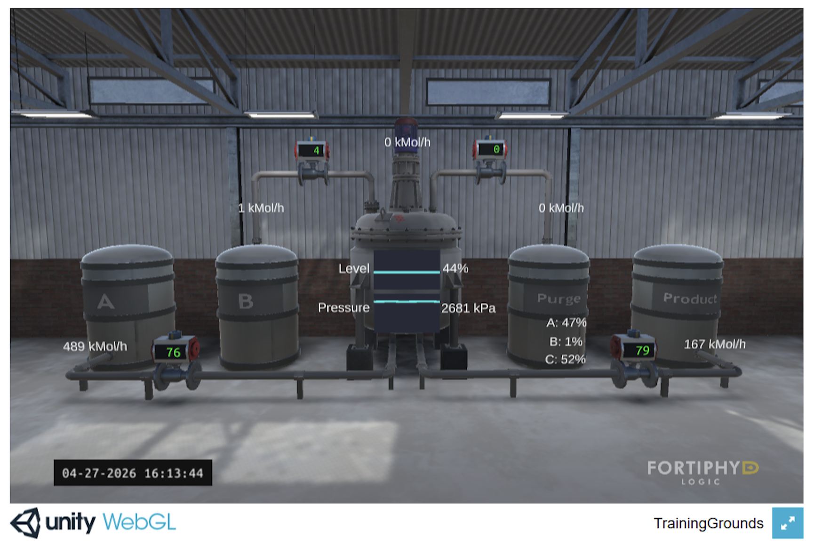
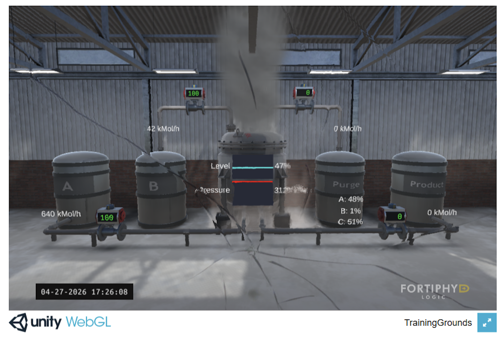

# modbus-security-bridge

## Overview
A security bridge that inspects Modbus TCP packets and blocks unauthorized commands in OT networks.

## Environment
- Windows11 machine
- VirtualBox
- Kali Linux
- GRFICSv3 (Industrial Control System Simulator)
- Wireshark

## Network Architecture (Attack Demonstration)
192.168.95.0/24

PLC (192.168.95.2)

 ↕
 
ChemicalPlant (192.168.95.10 ~ 192.168.95.13)

Kali Linux (192.168.95.100) ──attack─→ ChemicalPlant (192.168.95.10 ~ 192.168.95.13)

## GRFICS Chemical Plant Overview

The chemical plant simulation is visualized via browser at `http://192.168.95.10`.

Each valve is assigned an IP address and controlled by the PLC via Modbus TCP.

| IP Address | Location |
|---|---|
| 192.168.95.10 | Top-left valve (reactor input) |
| 192.168.95.11 | Bottom-left valve (reactor input) |
| 192.168.95.12 | Top-right valve (purge output) |
| 192.168.95.13 | Bottom-right valve (product output) |

The PLC controls each valve's opening degree via Modbus TCP.
For example, the PLC sends FC4 (Read Input Registers) to read the current valve state,
and FC6 (Write Single Register) to update the holding register and change the valve position.

## Modbus Protocol Analysis
See [docs/modbus_analysis.md](docs/modbus_analysis.md) for detailed packet analysis.

## Attack Demonstration
Executed `attack_demo.py` from Kali Linux using FC6 (Write Single Register) 
to send abnormal values at high speed.

- Input valves (192.168.95.10, 192.168.95.11): set to 65535 (fully open)
- Output valves (192.168.95.12, 192.168.95.13): set to 0 (fully closed)

This causes excessive material to flow into the reactor while blocking output,
rapidly increasing internal pressure and causing the reactor to explode.

| Normal | After Attack |
|---|---|
|  |  |

## Network Architecture (Bridge Setup)
192.168.95.0/24

PLC (192.168.95.2)

 ↕
 
Kali Linux - Security Bridge (192.168.95.100)

 ↕
 
ChemicalPlant (192.168.95.10 ~ 192.168.95.13)

ARP spoofing was used to place Kali Linux inline between the PLC and Chemical Plant.
Confirmed that Modbus traffic passes through Kali Linux using Wireshark.

## IP Forwarding Verification
To confirm that Kali Linux is properly placed inline, 
IP forwarding was tested in two states.

- `pcap/arpspoof_ip_forward_0.pcapng` : IP forwarding disabled.
  Modbus traffic between PLC and Chemical Plant was interrupted,
  confirming that traffic passes through Kali Linux.

- `pcap/arpspoof_ip_forward_1.pcapng` : IP forwarding enabled.
  Modbus traffic was successfully forwarded through Kali Linux.

## Blocking Rules
- FC6 (Write Single Register) with abnormal values
- FC16 (Write Multiple Registers) with abnormal values
- Any Modbus write command from unauthorized IP

## Status
Security bridge implementation is in progress.

## References
- GRFICS: https://github.com/mrideout/GRFICSv3
- 福田 敏博, 「現場で役立つOTの仕組みとセキュリティ 演習で学ぶ! わかる! リスク分析と対策」, 翔泳社, 2021
